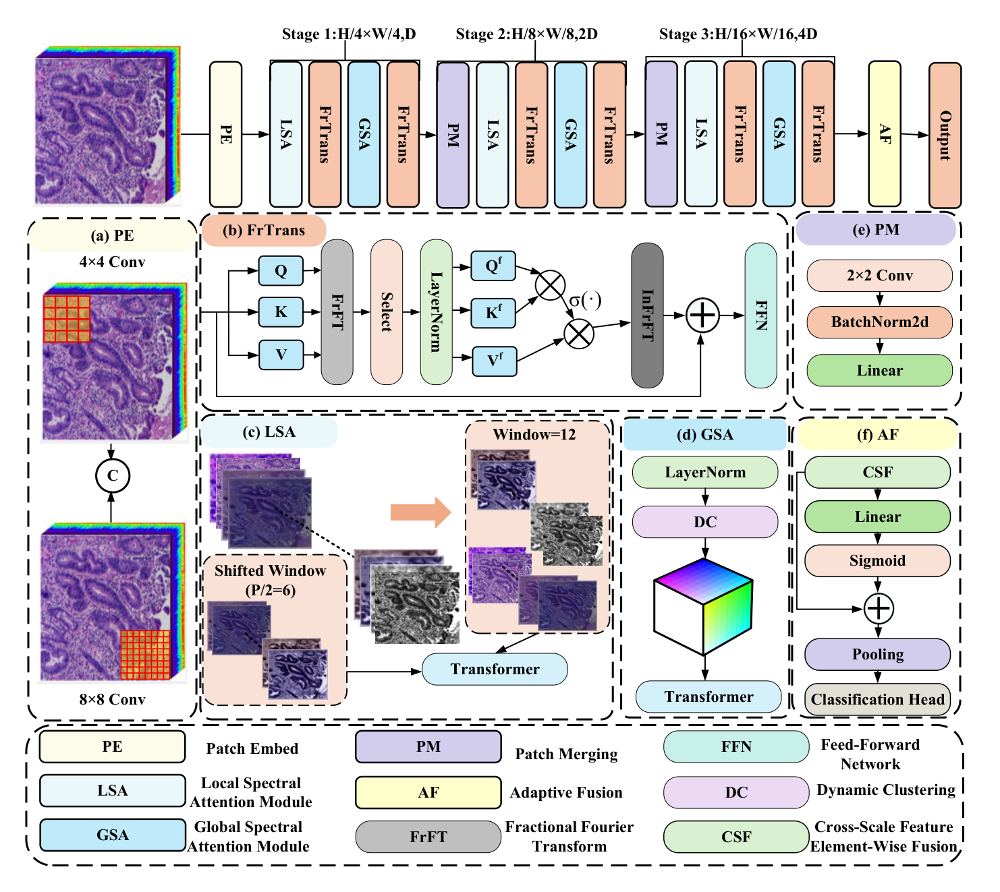
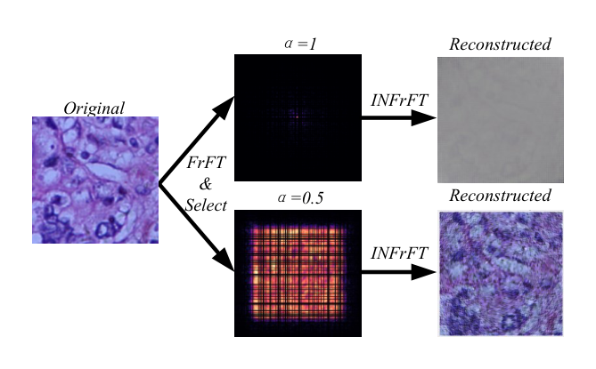
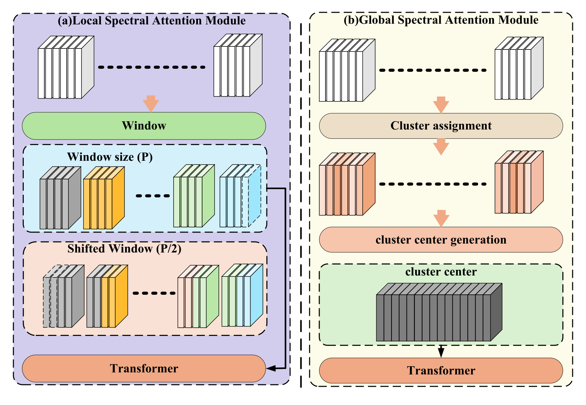
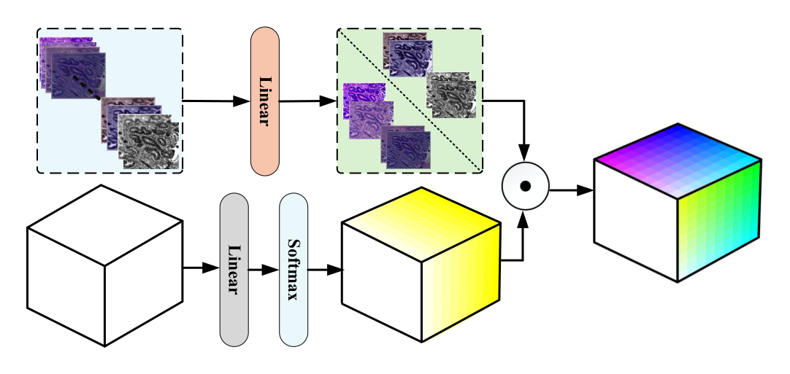
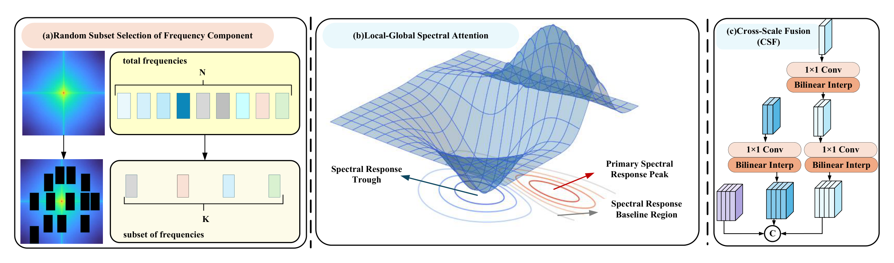
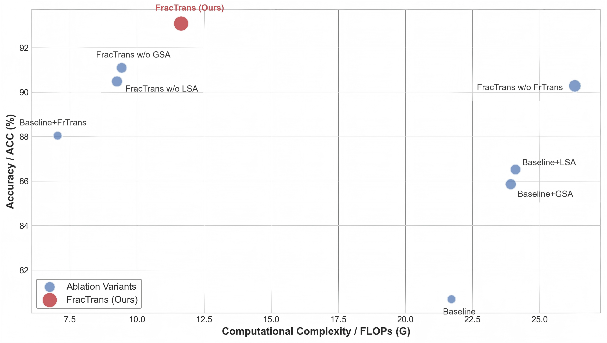
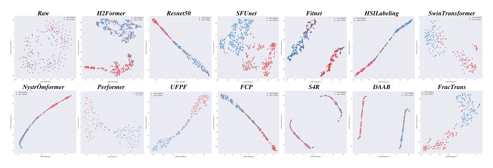

# FracTrans

**Fractional Fourier Transformer for Medical Hyperspectral Image Classification**

FracTrans is a transformer framework for medical hyperspectral image (MHSI) classification. It models non-stationary spatial–frequency correlations with a learnable Fractional Fourier Transform (FrFT), so that fine pathological details can be separated from global anatomical structures.

> Paper status: under revision for *IEEE Transactions on Image Processing* (TIP).

---

## Highlights

| Module | What it does |
|---|---|
| **Learnable FrFT Attention** | Adaptive spatial–frequency rotation with a trainable order \(\alpha\) |
| **Stochastic Frequency Sampling** | Randomly keeps \(K\) modes (\(K=64\)) to avoid \(\mathcal{O}(N^2)\) attention |
| **LSA + GSA** | Sliding local spectral attention + dual-channel global spectral attention |
| **Multi-scale Fusion** | Patch embedding, cross-scale fusion, and pathology-focused pooling |

On choledoch (MDC) and gastric precancerous lesion (PLGC) datasets, FracTrans outperforms strong CNN / Transformer / frequency-domain baselines. Integrating the FrTrans module yields a **+7.35%** accuracy gain in ablation.

---

## Architecture

<p align="center">
  
</p>

<p align="center"><em>Overall FracTrans pipeline: PatchEmbed → FrTrans → L-GSA → multi-scale fusion → classification.</em></p>

### Fractional Fourier vs. standard Fourier

<p align="center">
  
</p>

<p align="center"><em>Adaptive FrFT better preserves high-frequency pathological textures under the same mode dropping ratio.</em></p>

### Local–Global Spectral Attention

<p align="center">
  
  &nbsp;
  
</p>

### Feature fusion & ablation

<p align="center">
  
  
</p>

### t-SNE visualization

<p align="center">
  
</p>

---

## Repository Structure

```text
FracTrans/
├── model/
│   ├── FracTrans.py          # main model (updated)
│   └── __init__.py
├── dataset/
│   ├── DGA_dataset.py        # MDC / choledoch loader
│   └── PLGC_dataset.py       # PLGC loader
├── train_DGA.py              # training script (MDC)
├── train_PLGC.py             # training script (PLGC)
assets/                       # figures used in this README
└── README.md
```

---

## Requirements

- Python ≥ 3.8
- PyTorch ≥ 1.12 (CUDA recommended)
- NumPy

```bash
pip install torch torchvision numpy
```

---

## Quick Start

```python
import torch
from FracTrans.model.FracTrans import get_SFT_Swin, get_SFT_PLGC_Swin

# MDC / choledoch: 60 bands, binary classification
model = get_SFT_Swin(in_channels=60, num_classes=2, image_size=256)
x = torch.randn(1, 60, 256, 256)
logits, aux_logits = model(x)

# PLGC: 40 bands, 3-class classification
model_plgc = get_SFT_PLGC_Swin(in_channels=40, num_classes=3, image_size=256)
```

Self-check:

```bash
cd FracTrans/model
python FracTrans.py
```

Training (after preparing your dataset paths):

```bash
python train_DGA.py
python train_PLGC.py
```

---

## Method Summary

1. **Adaptive FrFT** rotates each token sequence into a fractional domain with learnable \(\alpha\).
2. **Random frequency mode selection** samples \(K\) modes from the energy-dominant half-spectrum and sorts indices before scatter / inverse FrFT reconstruction.
3. **Complex tanh attention** is computed per sample on the \(K\)-mode subspace (ordinary transpose \(K^\top\), scaled by \(\sqrt{d_k}\)).
4. **LSA / GSA** capture local band neighborhoods and long-range spectral clustering.
5. **Entropy-based multi-scale fusion + multiplicative pathology gating** produce the final representation for classification.

---

## Citation

If this repository helps your research, please cite our paper (details will be updated upon publication):

```bibtex
@article{chen2025fractrans,
  title   = {Dynamic Fractional Fourier Transformer with Local-Global Spectral Attention for Medical Hyperspectral Image Classification},
  author  = {Chen, Qikai and Liu, Huan and Qin, Geng and Xia, Xiang-Gen and Li, Wei and Tao, Ran},
  journal = {IEEE Transactions on Image Processing},
  year    = {2025},
  note    = {Under revision}
}
```

---

## License

Code is released for academic research. Please contact the authors for other use cases.

## Contact

- Qikai Chen — `qikaichen@bit.edu.cn`
- Corresponding author: Huan Liu — `huanliu233@gmail.com`
